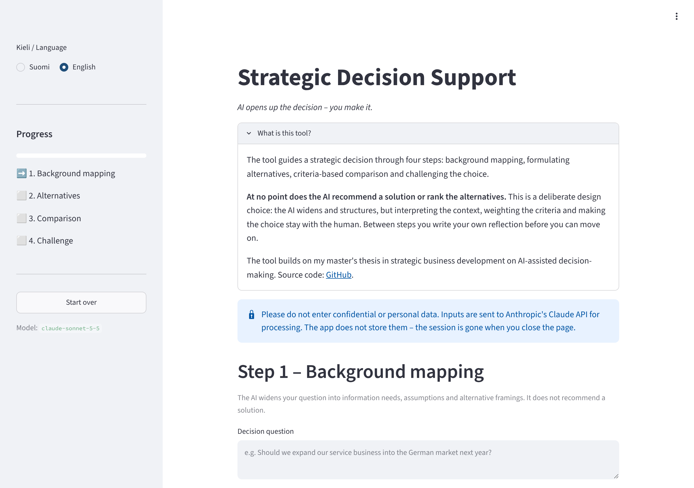

# Strategic Decision Support

**AI opens up the decision – you make it.**

A four-step web tool that uses a large language model (Anthropic Claude) to support strategic decisions *without* making them. The AI widens the question, sharpens the alternatives and fills in a comparison on the user's own criteria. It never recommends an option or ranks the alternatives.

▶ **Live demo (English):** https://strategic-tool-xwd6n5arv8mufhjsjxsaov.streamlit.app/?lang=en  
▶ **Live demo (suomeksi):** https://strategic-tool-xwd6n5arv8mufhjsjxsaov.streamlit.app/?lang=fi



---

## Why the AI never recommends

Most AI decision tools optimise for an answer. This one is deliberately designed the other way round.

In strategic decisions the hard part is rarely generating options – it is interpreting them in a specific organisational context: history, politics, risk appetite, capabilities, timing. A language model does not have that context, and a confident recommendation tends to anchor the decision-maker and shortcut exactly the thinking that matters.

So the tool splits the work:

| The AI does | The human does |
|---|---|
| Widens the question: information needs, hidden assumptions, alternative framings | Decides which of those actually matter |
| Checks that alternatives are concrete, distinct and complete | Formulates and confirms the alternatives |
| Fills in a comparison table – unweighted, flagging gaps as "requires further investigation" | Defines the criteria, weights them and makes the choice |
| Challenges the chosen option: risks, critical assumptions, checkpoints | Owns the decision |

Between the steps the user must write their own reflection before moving on. The design builds on my master's thesis in strategic business development on human contextualisation in AI-assisted decision-making.

## The four steps

1. **Background mapping** – the question is opened up into information needs, assumptions and alternative framings.
2. **Formulating alternatives** – the user drafts 2–4 options; the AI checks clarity, overlap and gaps.
3. **Comparison** – the user sets the criteria; the AI fills in a neutral comparison table.
4. **Challenging the choice** – after the user chooses, the AI surfaces unconsidered risks, critical assumptions and 3–6-month checkpoints.

The full session can be downloaded as a `.txt` or a printable `.html` report.

## Corrective action mode (ISO 10.2)

The same four steps work for nonconformity and corrective action handling in ISO management systems. ISO 9001, ISO 14001 and ISO 45001 share the same clause 10.2, so one workflow covers quality, environment and occupational health and safety. Select the mode in the sidebar or open it directly with `?mode=capa`.

| Step | Clause 10.2 | What the AI does – and does not do |
|---|---|---|
| 1. Nonconformity mapping | React, contain, establish the facts | Opens up missing facts, containment questions and possible cause areas. Does not name the root cause. |
| 2. Corrective actions | Determine the cause, decide on action | Classifies each proposed action as a *correction* or a *corrective action* against the user's root-cause hypothesis, and flags hypotheses that stop at "human error". Does not choose. |
| 3. Evaluating the actions | – | Fills in a neutral evaluation table on the user's criteria. |
| 4. Effectiveness | Verify effectiveness, update the system | Asks how effectiveness will be shown and what documented information, risk assessments or training records need updating. |

The no-recommendation principle matters even more here: in a management system a named person owns the analysis and the decision, which is also what an auditor expects to see. A fictional demo case is in [`docs/demo_corrective_action.md`](docs/demo_corrective_action.md). Use only fictional or anonymised cases in the public demo – real nonconformity data belongs in the organisation's own approved environment.

## Tech stack

- **Python** + **Streamlit** (UI and session state)
- **Anthropic Claude API** – model `claude-sonnet-5-5`, configurable via secrets
- **Streamlit Community Cloud** (hosting), **GitHub** (source)
- Bilingual UI and prompts (Finnish / English), selectable in the sidebar or with `?lang=en` / `?lang=fi`

## Responsible-use details

- **No data storage.** Inputs are sent to the Claude API for processing and live only in the browser session.
- **Secrets stay out of the code.** The API key is read from Streamlit secrets; `.streamlit/secrets.toml` is git-ignored.
- **Cost control.** The demo runs on a dedicated API key with a monthly spend limit, input lengths are capped and the model's reasoning effort is set to `low`. If the limit is reached, users see a clear message instead of a crash.
- **Safe rendering.** Model output is rendered as plain Markdown (no raw HTML), and the downloadable HTML report escapes all user and model text.

## Run locally

```bash
git clone https://github.com/juliuspyrhonen/strategic-tool.git
cd strategic-tool
pip install -r requirements.txt
cp .streamlit/secrets.toml.example .streamlit/secrets.toml   # then add your own API key
streamlit run app.py
```

Optional settings in `secrets.toml`: `ANTHROPIC_MODEL`, `ANTHROPIC_EFFORT` (`low` / `medium` / `high`), `MAX_TOKENS`, `CONTACT_EMAIL`.

## Author

**Julius Pyrhönen** – M.Sc. (Econ. & Bus. Adm.), strategic business development · Kokkola, Finland

---

### Suomeksi lyhyesti

Strateginen päätöstuki on neljän vaiheen työkalu, jossa tekoäly laajentaa päätöskysymyksen, tarkistaa vaihtoehtojen muotoilun, täyttää vertailutaulukon käyttäjän omilla kriteereillä ja kyseenalaistaa tehdyn valinnan – mutta ei koskaan suosittele ratkaisua eikä järjestä vaihtoehtoja. Tulkinta, painotus ja valinta jäävät ihmiselle. Toinen tila soveltaa samoja vaiheita ISO-hallintajärjestelmien poikkeamien ja korjaavien toimenpiteiden käsittelyyn (kohta 10.2). Työkalu pohjautuu pro gradu -tutkielmaani tekoälyavusteisesta päätöksenteosta. Kokeile: https://strategic-tool-xwd6n5arv8mufhjsjxsaov.streamlit.app/?lang=fi
